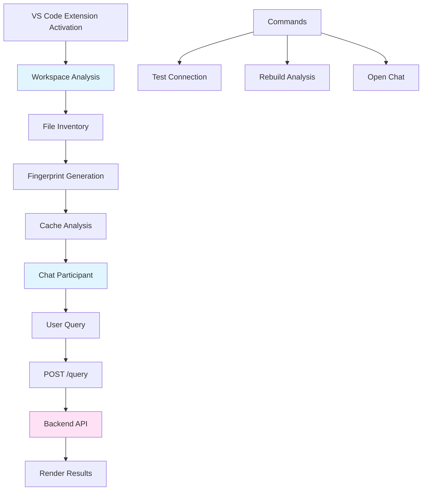

# AI_CODE_SNIPPET_RAG VS Code Extension Implementation

## Overview

Create a VS Code extension that integrates with the AI_CODE_SNIPPET_RAG backend. The extension will analyze the workspace, send queries to the backend API, and display results in VS Code's chat interface.

## Backend Context

This extension connects to the **AI_CODE_SNIPPET_RAG** backend API. The following context is essential for proper integration:

### Backend Architecture

- **Framework:** FastAPI (Python 3.11)
- **Port:** 8000 (exposed in Docker)
- **Base URL:** `http://localhost:8000` (default, configurable)
- **API Versioning:** `/api/v1` prefix for versioned endpoints
- **CORS:** Enabled with `ALLOWED_ORIGINS: "*"` (allows all origins)

### Current Backend Endpoints

**Root Level (no prefix):**

- `GET /` - Root health check
  - Returns: `{ "message": "...", "version": "1.0.0", "status": "running" }`
- `GET /health` - Health check endpoint
  - Returns: `{ "status": "healthy", "service": "...", "version": "1.0.0", "timestamp": "..." }`

**Versioned Endpoints (`/api/v1` prefix):**

- `POST /api/v1/ingest/ingest` - Code repository ingestion
  - Body: `CodeRepository` schema (name, url, branch, commit, path, ignore, include, exclude, etc.)

### Expected Query Endpoint

The extension expects a **root-level** `/query` endpoint (not under `/api/v1`):

- `POST /query` - Query endpoint for code RAG
  - **Request Body:**
    ```json
    {
      "query": "string",
      "repo_context": {
        "workspaceName": "string",
        "workspaceRoot": "string",
        "fingerprint": "string (sha256)",
        "fileCount": number,
        "activeFile": "string | null",
        "selection": { "startLine": number, "endLine": number } | null,
        "files": [
          {
            "path": "string",
            "size": number,
            "mtime": number,
            "languageId": "string (optional)",
            "sample": "string (optional, truncated)"
          }
        ]
      }
    }
    ```

  - **Response Body:**
    ```json
    {
      "answers": [
        {
          "file": "string",
          "start_line": number,
          "end_line": number,
          "code": "string",
          "score": number,
          "explanation": "string"
        }
      ]
    }
    ```


### Backend Infrastructure

The backend runs in Docker Compose with these services:

- **API Container:** `code_rag_api` on port 8000
- **Qdrant:** Vector database on ports 6333 (API), 6334 (gRPC)
- **Neo4j:** Graph database on ports 7474 (HTTP), 7687 (Bolt)
- **Redis:** Cache on port 6379

### Backend Configuration

**Location:** `src/app/config.py`

- `API_V1_STR: "/api/v1"` - API version prefix
- `PROJECT_VERSION: "1.0.0"`
- `ALLOWED_ORIGINS: "*"` - CORS enabled for all origins

### Backend Dependencies

- FastAPI 0.104.1
- Uvicorn 0.24.0
- Pydantic 2.12.5
- Neo4j 6.0.3
- Qdrant Client 1.16.2
- Redis 5.0.1

### Backend Workspace Structure

The backend workspace has the following structure:

```
AI_Code_Snippet_RAG/
├── src/
│   ├── app/
│   │   ├── api/
│   │   │   ├── router.py          # Main API router (includes /api/v1 routes)
│   │   │   └── routes/
│   │   │       └── ingest.py       # Ingestion endpoint
│   │   ├── config.py               # Settings (API_V1_STR="/api/v1", etc.)
│   │   ├── main.py                 # FastAPI app, /health endpoint
│   │   └── schemas/
│   │       └── CodeRepository.py   # Pydantic models
│   ├── core/
│   ├── database/
│   └── utils/
├── config/
│   └── config.yaml
├── docker-compose.yaml             # Backend services (api, qdrant, neo4j, redis)
├── Dockerfile                      # Python 3.11, exposes port 8000
└── requirements.txt                # Python dependencies
```

**Key Files:**

- `src/app/main.py` - FastAPI application, defines `/health` endpoint
- `src/app/api/router.py` - Routes `/api/v1` endpoints
- `src/app/config.py` - Configuration with `API_V1_STR="/api/v1"`
- `docker-compose.yaml` - Backend runs on port 8000, container name `code_rag_api`

### Connection Notes

- The backend must be running before using the extension
- Default connection: `http://localhost:8000`
- Health check available at: `http://localhost:8000/health`
- Query endpoint expected at: `http://localhost:8000/query` (root level, not `/api/v1/query`)
- Extension uses configurable `coderag.serverUrl` setting (defaults to `http://localhost:8000`)

## Architecture



## File Structure

```
vscode-extension/
├── package.json          # Extension manifest with commands, settings, chat participant
├── tsconfig.json         # TypeScript configuration
├── src/
│   └── extension.ts      # Main extension implementation
└── README.md             # Extension documentation
```

## Implementation Details

### 1. package.json Configuration

**Location:** `vscode-extension/package.json`

- **Activation:** `onStartupFinished` to ensure workspace is available
- **Commands:**
  - `coderag.openChat` - Opens chat panel
  - `coderag.testConnection` - Tests backend connectivity
  - `coderag.rebuildAnalysis` - Rebuilds workspace analysis
- **Chat Participant:** `coderag.ask` with name "Ask CodeRAG"
- **Settings:**
  - `coderag.serverUrl` (default: "http://localhost:8000")
  - `coderag.requestTimeoutMs` (default: 20000)
  - `coderag.maxFiles` (default: 5000)
  - `coderag.maxBytesPerFile` (default: 40000)

### 2. Workspace Analysis Module

**Location:** `vscode-extension/src/extension.ts`

**Key Functions:**

- `analyzeWorkspace()` - Main analysis function
  - Uses `vscode.workspace.findFiles()` with exclude patterns
  - Limits to `coderag.maxFiles` files
  - Collects file stats (size, mtime) via `vscode.workspace.fs.stat()`
  - Sample-reads text files (ts/tsx/js/jsx/py/cs/java/go/rs/md/json/yml/yaml/toml)
  - Truncates to `coderag.maxBytesPerFile`
  - Excludes sensitive files (.env, secrets*, id_rsa*, *.pfx, *.pem)
- `computeFingerprint()` - SHA256 hash of sorted "<path>|<size>|<mtime>" strings
- `getLanguageId()` - Maps file extensions to VS Code language IDs

**Caching:**

- In-memory cache keyed by workspace folder URI
- Invalidated on workspace folder change or rebuild command

### 3. Backend Connectivity

**Location:** `vscode-extension/src/extension.ts`

**Functions:**

- `testConnection()` - GET request to `{serverUrl}/health`
- `sendQuery()` - POST request to `{serverUrl}/query` with:
  ```typescript
  {
    query: string,
    repo_context: {
      workspaceName: string,
      workspaceRoot: string,
      fingerprint: string,
      fileCount: number,
      activeFile: string | null,
      selection: { startLine: number, endLine: number } | null,
      files: Array<{
        path: string,
        size: number,
        mtime: number,
        languageId?: string,
        sample?: string
      }>
    }
  }
  ```

- Uses `AbortController` for timeout handling
- Error handling with clear markdown messages

### 4. Chat Participant Implementation

**Location:** `vscode-extension/src/extension.ts`

**Chat Participant Handler:**

- On user message:

  1. Ensure workspace analysis is cached (run if needed)
  2. Get active editor context (file path, selection)
  3. Build request payload with analysis data
  4. POST to backend
  5. Parse response: `{ answers: [{ file, start_line, end_line, code, score, explanation }] }`
  6. Render markdown:

     - **file** (lines a–b) [score]
     - Fenced code block with language
     - Explanation text

### 5. Logging

**Location:** `vscode-extension/src/extension.ts`

- OutputChannel: "CodeRAG" (or "AI_CODE_SNIPPET_RAG")
- Log events:
  - Extension activation
  - Server URL configuration
  - Analysis start/end with file count
  - Fingerprint prefix (first 8 chars)
  - Request start/end with status
  - Errors with full details

### 6. TypeScript Configuration

**Location:** `vscode-extension/tsconfig.json`

- Target: ES2020
- Module: CommonJS
- Include: `src/**/*`
- Use Node.js built-in `crypto` for SHA256

## Key Implementation Notes

1. **File Reading:** Use `vscode.workspace.fs.readFile()` and decode as UTF-8, handling encoding errors gracefully
2. **Fingerprint:** Use Node.js `crypto.createHash('sha256')` for stable hashing
3. **Error Handling:** All backend errors should show user-friendly markdown in chat, with detailed logs in OutputChannel
4. **Performance:** Analysis runs once per session unless workspace changes or rebuild is triggered
5. **Security:** Never read sensitive files (.env, secrets, keys) even if they match text file extensions

## Dependencies

- `@types/vscode` - VS Code API types
- `@types/node` - Node.js types
- `typescript` - TypeScript compiler

No external HTTP libraries needed - use Node.js built-in `fetch` (Node 18+) or `https` module.

## Testing Steps

1. Verify backend: `curl http://localhost:8000/health`
2. Install dependencies: `cd vscode-extension && npm install`
3. Compile: `npm run compile`
4. Run extension: F5 in VS Code
5. Configure: Settings → CodeRAG → serverUrl (if needed, defaults to `http://localhost:8000`)
6. Test: Run "CodeRAG: Test Connection" command (tests `GET {serverUrl}/health`)
7. Use: Open chat, type query, check OutputChannel for logs

### Backend Connection Verification

Before testing the extension:

1. Ensure Docker Compose backend is running: `docker compose up`
2. Verify API is accessible: `curl http://localhost:8000/health`
3. Expected response: `{"status": "healthy", "service": "...", "version": "1.0.0", "timestamp": "..."}`
4. Note: The `/query` endpoint must be implemented in the backend to handle extension requests